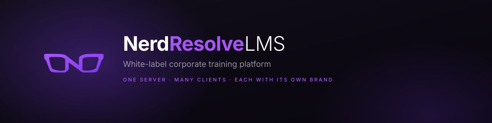

<div align="center">



Um servidor, muitos clientes — cada um com seu domínio, sua marca e seu
conjunto de funcionalidades.

[](LICENSE.md)   

**[Personalizar em 4 passos](#personalizar-em-4-passos)** · [Funcionalidades](#o-que-vem-dentro) · [Rodar](#rodar) · [Documentação](#documentação) · [Licença](#licença)

</div>

---

## O que é

Uma plataforma de EAD completa, pronta para ser entregue com a cara de outra
empresa. Alguém abre `treinamento.suaempresa.com`, vê o logo e as cores da
empresa dela, entra com a conta corporativa e faz os cursos dela — sem nunca
saber que o mesmo servidor atende outros clientes.

A comparação de referência é o Moodle: SCORM, xAPI, LTI 1.3, cmi5, QTI,
competências, distintivos, fórum e relatórios estão implementados. A diferença
está em quanto disso um cliente precisa ver — aqui, cada funcionalidade liga e
desliga por cliente, e o que fica desligado some da interface em vez de ficar
ocupando menu.

### Um servidor, muitos clientes

O isolamento é por `tenant_id`, resolvido pelo domínio da requisição. Não é
convenção: **toda tabela com dado de cliente tem a coluna, e toda consulta
filtra por ela.**

Uma consulta que esquece o recorte não dá erro — ela devolve o dado de outra
empresa. Por isso um portão de teste lê o SQL de todos os repositórios e falha
o build quando aparece uma leitura sem `tenant_id`: é o tipo de esquecimento
que passa em revisão de código e só se manifesta como vazamento.

---

## Personalizar em 4 passos

**Tudo pela tela de administração. Sem tocar em código, sem recompilar nada.**

Entre como administrador e vá em **Administração → Plataforma**.

### 1. Bota a logo

Três campos, três uploads:

| Campo | Onde aparece |
|---|---|
| **Logo clara** | Tema claro — cabeçalho e tela de login |
| **Logo escura** | Tema escuro |
| **Favicon** | Aba do navegador |

> Se o cliente só tem uma versão do logo, use a mesma nos dois campos. PNG ou
> SVG, fundo transparente.

### 2. Muda a cor

Um campo. Você escolhe **uma cor** — a da marca do cliente — e a plataforma
inteira se ajusta: botões, links, foco, gráficos, fundo suave, borda.

Não existe um segundo campo para acertar depois. A paleta é derivada, e o
contraste é resolvido sozinho: a cor é preservada onde aparece como superfície
(quem pediu amarelo recebe amarelo no botão, não marrom) e escurecida onde
vira texto sobre fundo claro, até alcançar 4.5:1.

### 3. Escolhe o que fica ligado

Uma lista de chaves. Ligue e desligue à vontade — o que sai desaparece da
interface, dos menus e das notificações.

```
comentarios              forum                 gamificacao
├── respostas            ├── anexos            ├── distintivos
└── upvotes              └── denuncias         └── loja

notificacoes             rigor                 trilhas
└── email                ├── video             agenda
                         └── leitura           certificados
                                               favoritos
                                               busca
```

Desligar um pai desliga os filhos — é o que impede o estado incoerente de
"upvote ligado num produto sem comentários".

> **A família `rigor` nasce desligada**, ao contrário das demais. São travas de
> conclusão — impedir de arrastar o vídeo para o fim, confirmar a leitura de um
> documento lido rápido demais — e travas atrapalham quem não precisa delas. Um
> curso de integração não tem o mesmo peso que um de segurança em espaço
> confinado.

### 4. Liga o acesso da empresa

Quatro caminhos, combináveis, **já pré-configurados**. O cliente cola as
credenciais e liga a chave — não há integração para montar.

| Caminho | O que pedir ao cliente |
|---|---|
| **Google Workspace** | Client ID e secret do Google Cloud |
| **Microsoft Entra ID** | Client ID, secret e o tenant do Azure |
| **LDAP / Active Directory** | Host, base DN e o domínio |
| **SAML 2.0** | Metadados do IdP — ADFS, Okta, Azure, Shibboleth |

As URLs de autorização, token e JWKS do Google e da Microsoft já vêm
preenchidas. Para SAML, a plataforma publica o próprio metadado: o cliente
entrega ao time de identidade dele e recebe o do IdP de volta.

Senha local continua disponível e pode ser **desligada** — para o cliente que
exige que todo acesso passe pelo diretório da empresa.

### E o domínio

Único passo fora da tela: aponte um `CNAME` para o servidor e cadastre o
domínio no cliente. O certificado é emitido automaticamente. Vários clientes
convivem no mesmo servidor, cada um no seu domínio.

**Pronto.** O passo a passo detalhado — com os comandos, os campos e o que
conferir antes de entregar — está em **[WHITELABEL.md](WHITELABEL.md)**.

---

## O que vem dentro

<table>
<tr><td width="33%" valign="top">

**Aprender**

Vídeo, PDF, planilha, slide, SCORM, H5P e conteúdo interativo. Trilhas com
pré-requisito, agenda, favoritos e busca. Retomada de onde parou, em qualquer
dispositivo.

</td><td width="33%" valign="top">

**Avaliar**

Banco de questões, provas, tarefas com envio de arquivo e correção com
feedback. Competências por nível, distintivos e certificados com código de
validação pública.

</td><td width="33%" valign="top">

**Administrar**

Turmas, matrícula em massa, relatórios, auditoria de acesso, backup e
exportação. API com chave por escopo e webhooks.

</td></tr>
</table>

### Interoperabilidade

| Padrão | Situação |
|---|---|
| **SCORM 1.2 e 2004** | Importa o pacote e roda o runtime completo |
| **xAPI (Tin Can)** | LRS próprio, com anonimização configurável |
| **cmi5** | Os nove verbos, com separação de autoridade |
| **LTI 1.3** | Provedor e consumidor, com AGS e NRPS |
| **QTI 2.x e 3.0** | Importa e exporta banco de questões |
| **H5P** | Importa vídeo interativo, hotspots e flashcards |
| **CSV** | Usuários, cursos e questões |

Nada disso depende de serviço externo: o LRS, o runtime SCORM, o verificador de
assinatura SAML e o cliente LDAP são implementação própria, dentro do
repositório.

---

## Rodar

### Ver antes de instalar

Abra `apps/frontend/preview/landing.html` no navegador.

O protótipo navega inteiro, sem servidor nem banco: concluir aula, favoritar,
comentar, votar, editar curso, publicar.

### Subir de verdade

```bash
cp infra/.env.example infra/.env     # preencha domínio, senhas e chaves
npm install
npm run up                           # sobe app, banco, storage e proxy
npm run migrate                      # aplica o schema
npm run seed                         # dados de demonstração (opcional)
```

A plataforma responde em `https://localhost`. Para publicar num domínio real,
veja [docs/DEPLOY.md](docs/DEPLOY.md).

### Portões de qualidade

Todos rodam offline:

```bash
npm run verify           # tudo abaixo, de uma vez
npm test                 # 1190 testes
npm run typecheck
npm run test:a11y        # contraste WCAG AA, token a token
npm run check:sql        # estrutura das migrações
npm run check:encoding   # todo fonte em UTF-8
npm run check:layers     # dependências só na direção frontend → backend → core
npm run check:imports    # todo pacote importado está declarado
npm run perf             # LCP, CLS, TBT, alvos de toque
```

---

## Arquitetura

```
packages/core/     Regras de negócio. Sem I/O, sem banco, sem HTTP.
                   É onde ficam SCORM, xAPI, SAML, LDAP, QTI e as regras
                   de conclusão. Testável sem subir nada.

apps/backend/      Casos de uso e repositórios. Todo SQL vive aqui.
                   Não é um servidor: é o que as rotas do Next chamam.

apps/frontend/     Next.js 15 e React 19. Telas e rotas de API.

infra/             Compose, migrações, proxy e portões de verificação.
```

A dependência é de mão única — `frontend → backend → core` — e um portão
verifica que continua sendo. O núcleo não sabe que existe banco; o backend não
sabe que existe React.

---

## Documentação

| Documento | Para quê |
|---|---|
| [WHITELABEL.md](WHITELABEL.md) | **Implantar para um cliente novo**, do zero à entrega |
| [docs/DEPLOY.md](docs/DEPLOY.md) | Subir a plataforma num servidor |
| [docs/PRD.md](docs/PRD.md) | Escopo, perfis de acesso e decisões de produto |
| [docs/HOMOLOGACAO.md](docs/HOMOLOGACAO.md) | O que conferir antes de liberar |
| [docs/DESIGN-SYSTEM-package.md](docs/DESIGN-SYSTEM-package.md) | Tokens, componentes e regras visuais |
| [docs/telas/](docs/telas/) | Capturas em desktop e mobile |

---

## Licença

**PolyForm Noncommercial License 1.0.0** — veja [LICENSE.md](LICENSE.md).

Você **pode** ler, modificar, redistribuir e usar para qualquer finalidade não
comercial: estudo, pesquisa, avaliação técnica, projeto pessoal, e uso por
instituição de ensino, órgão público ou organização sem fins lucrativos.

Você **não pode** usar com finalidade comercial — operar a plataforma para
clientes, vendê-la, revendê-la, oferecê-la como serviço, embuti-la em produto
pago ou usá-la internamente numa empresa com fins lucrativos.

Para licença comercial, fale com a NerdResolve: **contato@mariath.dev**

---

<div align="center">


**NerdResolve LMS** — desenvolvido por [Matheus Mariath](https://github.com/mariathdev) · NerdResolve

</div>
