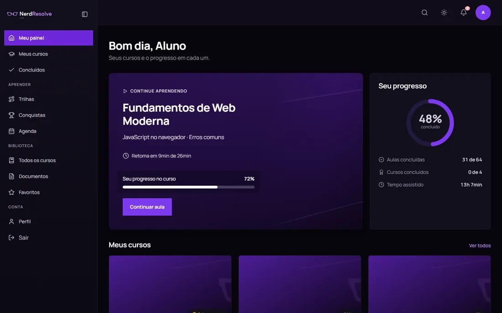
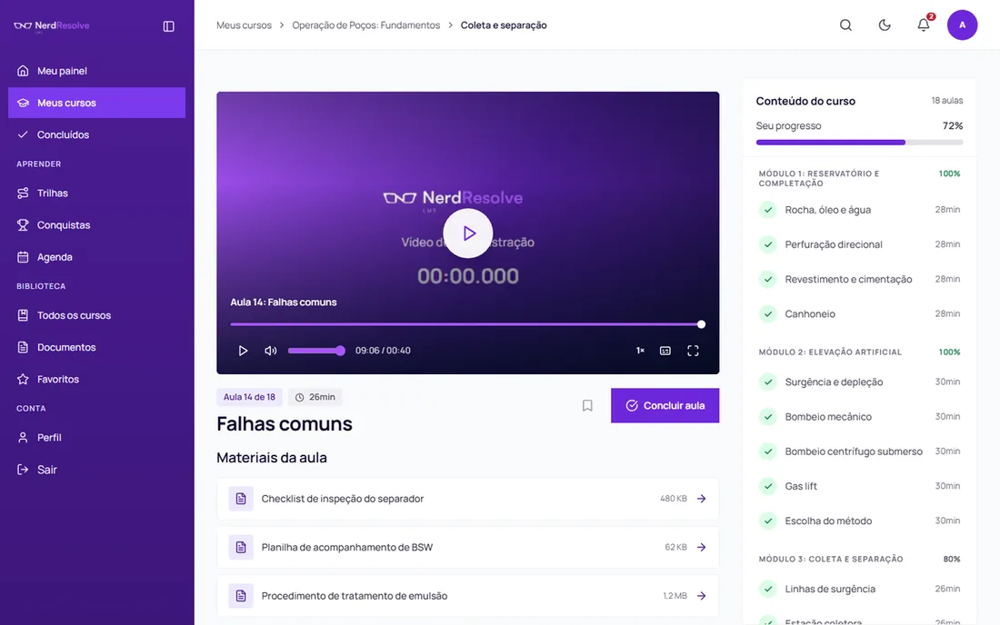
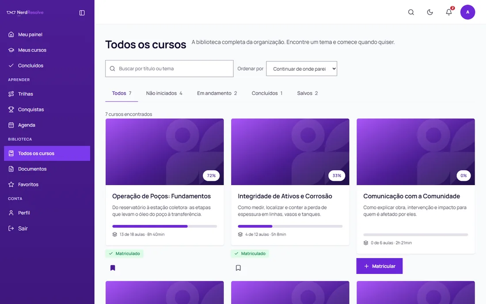
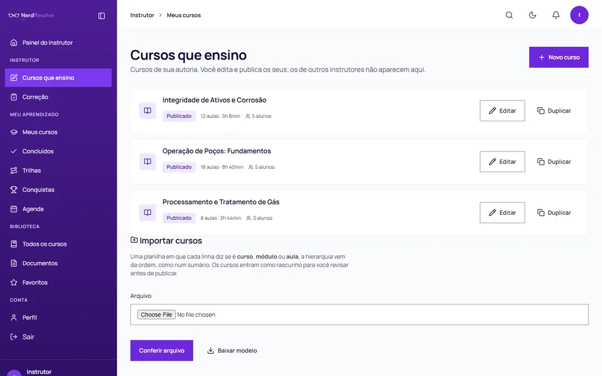
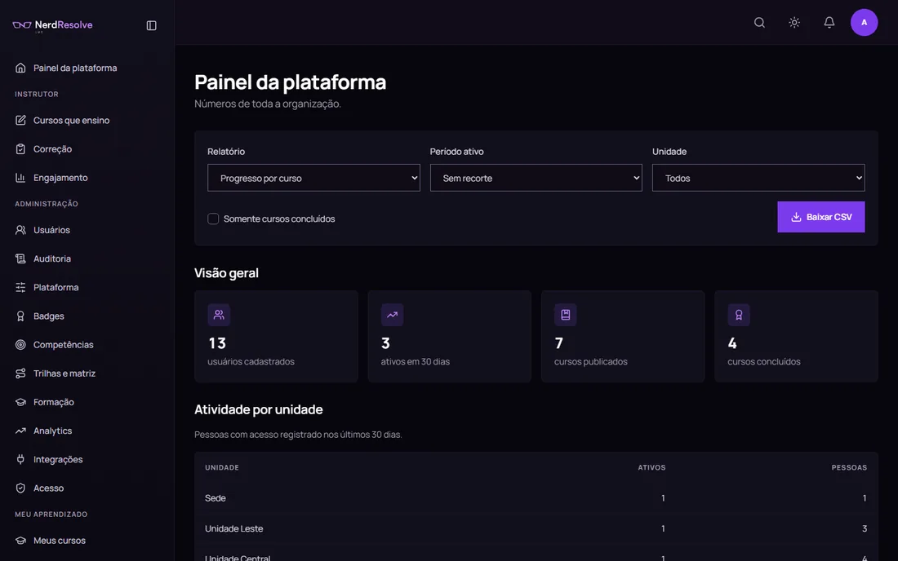

<div align="center">


# NerdResolve LMS

**Plataforma de ensino corporativo white-label.** Uma instalação atende vários
clientes, cada um com domínio, marca e cores próprios, sem um enxergar o outro.

[](https://github.com/nerdresolve/NerdLMS/actions/workflows/ci.yml)
[](https://github.com/nerdresolve/NerdLMS/actions/workflows/seguranca.yml)
[](LICENSE.md)
[](.nvmrc)

**[Ver funcionando →](https://lms.nerdresolve.com)** &nbsp;·&nbsp; entre com
`user.mock` / `usermock`



</div>

---

## Índice

- [Por que existe](#por-que-existe)
- [Subir em 5 minutos](#subir-em-5-minutos)
- [O que cada pessoa faz aqui](#o-que-cada-pessoa-faz-aqui)
- [Como o progresso é medido](#como-o-progresso-é-medido)
- [Arquitetura](#arquitetura)
- [Personalizar para o seu cliente](#personalizar-para-o-seu-cliente)
- [Publicar](#publicar)
- [Qualidade](#qualidade)
- [Interoperabilidade](#interoperabilidade)
- [Segurança](#segurança)
- [Referência de comandos](#referência-de-comandos)

---

## Por que existe

Plataforma de treinamento corporativo costuma ser alugada por usuário ativo. O
limite é contratual, não técnico. O histórico de quem cursou o quê, com que nota
e em que data fica na base de outra empresa, e quando o contrato termina a
exportação é um CSV, se houver.

Aqui você hospeda, é dono do dado e a marca na tela é a sua.

**Estado atual:** 38 telas, 65 rotas de API, 83 tabelas, 46 migrações e 1.444
testes automatizados.

---

## Subir em 5 minutos

Precisa de **Node 22+** e **Docker**.

```bash
git clone https://github.com/nerdresolve/NerdLMS.git
cd NerdLMS
npm ci

cp infra/.env.example infra/.env
```

Abra `infra/.env` e gere um valor para cada segredo:

```bash
openssl rand -hex 32   # POSTGRES_PASSWORD
openssl rand -hex 32   # APP_DB_PASSWORD  (repita dentro da DATABASE_URL)
openssl rand -hex 32   # STORAGE_SECRET_KEY
openssl rand -hex 48   # SESSION_SECRET
```

> **`-hex`, não `-base64`.** O base64 emite `/` e `+`. A senha da aplicação
> entra dentro de `DATABASE_URL=postgres://lms_app:SENHA@db:5432/nerdlms`, e uma
> barra ali encerra a autoridade da URL: o contêiner sobe e morre com
> `TypeError: Invalid URL`, sem dizer qual variável está errada.

Se as portas 80 e 443 já estiverem ocupadas na sua máquina, ajuste no mesmo
arquivo:

```ini
HTTP_PORT=9080
HTTPS_PORT=9443
STORAGE_PUBLIC_ENDPOINT=https://localhost:9443
```

Então:

```bash
npm run up        # banco, storage, aplicação e proxy
npm run migrate   # aplica as 46 migrações
npm run seed      # catálogo e contas de demonstração
```

A plataforma responde em **<https://localhost>** (ou na porta que você
escolheu). O certificado é interno, então o navegador avisa. É esperado.

### Contas de demonstração

| Perfil | Usuário | Senha |
|---|---|---|
| Administrador | `admin.mock` | `adminmock` |
| Gestor | `manager.mock` | `managermock` |
| Instrutor | `instructor.mock` | `instructormock` |
| Aluno | `user.mock` | `usermock` |

> O seed **recusa rodar** sem `-v allow_seed=yes` e usa senhas derivadas do
> login. É adequado para homologação e inaceitável fora dela.

As mesmas contas valem em **<https://lms.nerdresolve.com>**, uma instalação de
demonstração com este mesmo seed. É uma vitrine, não um serviço: os dados são
reapagados a cada atualização e ela pode estar fora do ar sem aviso. Para
avaliar de verdade, suba a sua com os três comandos acima.

### Sem Docker

Os testes, os portões de acessibilidade e o protótipo navegável rodam sem nada
além do npm:

```bash
npm run test          # 1.444 testes
npm run test:a11y     # contraste WCAG AA, token a token
npm run preview       # gera apps/frontend/preview/*.html
```

Abra qualquer arquivo de `apps/frontend/preview/` no navegador: são as 21 telas
com o CSS real do produto e dados do seed, sem servidor.

---

## O que cada pessoa faz aqui

### Aluno



Assiste à aula, baixa o material, comenta, faz a prova e recebe o certificado.
A aula **retoma de onde parou**, no computador ou no celular.

O catálogo separa o que está em andamento, concluído e salvo. Há trilhas
(sequências de cursos), agenda com prazos, e conquistas: moedas por aula
concluída, distintivos por marco, e um destaque mensal por contribuição no
fórum, não por velocidade.



### Instrutor



Cria curso, módulo e aula. Envia vídeo, PDF, planilha, pacote SCORM ou H5P.
Monta prova a partir de um banco de questões, corrige dissertativa por rubrica
e decide os pedidos de reteste, liberando ou recusando **com comentário
obrigatório**.

Vê o engajamento da turma: quem começou, quem parou, onde o vídeo perde gente.
Meses depois, registra a **eficácia do treinamento**: se o desempenho mudou de
verdade, que é a pergunta que a fiscalização faz.

### Gestor

Acompanha a própria equipe: quem está em dia, quem vence prazo, quem nunca
começou. O recorte é por unidade organizacional, e ele não enxerga fora dela.

### Administrador



Pessoas, acesso e auditoria. Competências e plano de formação por cargo.
Trilhas por função e por local. Distintivos, biblioteca de conteúdos,
integrações e a marca do cliente.

Os relatórios saem em CSV com recorte por período e por unidade.

---

## Como o progresso é medido

Vale entender antes de adotar, porque é aqui que as plataformas diferem.

**Concluir uma aula exige 90% de cobertura do vídeo com tempo de sessão
compatível.** Arrastar a barra até o fim não conta: o tempo real assistido é
comparado com a duração da aula, e uma sessão curta demais é recusada. O avanço
para trecho não assistido é bloqueado, e isso se configura por curso:
treinamento obrigatório e comunicado interno não pedem o mesmo rigor. Retroceder
é livre, e a velocidade vai até 2x.

**A prova só libera quando as aulas terminam**, e o botão diz quantas faltam em
vez de deixar clicar e recusar depois. Nota de 0 a 10, com aprovação
configurável. Quem reprova precisa **pedir reteste ao instrutor**, que libera
ou recusa. Não é autosserviço.

**O certificado é conferível.** O código em `/validar` não é consultado numa
lista: a verificação reavalia matrícula, conclusão e nota, aplicando a mesma
regra da emissão. Um certificado de alguém que foi desmatriculado depois não
valida.

---

## Arquitetura

```
apps/frontend/    Next.js 15 + React 19: telas e rotas HTTP
apps/backend/     casos de uso, repositórios e integrações
packages/core/    regra de domínio pura: sem React, sem SQL, sem framework
infra/            docker-compose, migrações, proxy e ferramentas
```

As camadas têm direção (`frontend → backend → core`) e um portão automático
(`npm run check:layers`) reprova import na direção errada.

Isso mantém a regra de negócio testável sem subir infraestrutura: os **1.357
testes do `core` rodam em segundos, sem Docker e sem banco**. A regra que decide
se uma aula pode ser concluída é uma função pura sobre números; o repositório
que lê o Postgres é outra coisa, em outra camada.

`apps/backend` não sobe um servidor próprio. Ele é a camada que as rotas do
Next chamam: o `route.ts` continua em `apps/frontend/src/app/api/`, porque no
Next a rota é o arquivo. Essas rotas são cascas finas.

### Multi-tenant desde o schema

Toda consulta filtra por `tenant_id`, e há teste automatizado cobrindo o
isolamento (`query-isolation.test.ts`). O tenant vem do domínio da requisição;
sem domínio cadastrado, cai no padrão.

---

## Personalizar para o seu cliente

São **duas camadas**, e confundi-las é o erro comum.

### A marca do produto

Quem opera a plataforma. Aparece enquanto o domínio não identificar nenhum
cliente: acesso inicial, login, recuperação de senha, validação de certificado.

Um arquivo:

```ts
// packages/core/src/brand/brand.config.ts
export const NOME = "Academia ACME";
export const COR  = "#0F766E";
```

Troque os quatro PNGs em `apps/frontend/public/brand/` (mantendo nomes e
proporções), rode `npm run preview` e pronto. A rampa de cor da interface fica
em `apps/frontend/src/styles/nerd-ds/tokens/colors.css`.

```bash
npm run test:a11y
```

**Reprova se a cor nova não passar em contraste WCAG AA.** É de propósito:
acessibilidade é régua do produto, não escolha por cliente.

### A marca do cliente

Cada tenant informa **uma cor** e as próprias logos, pela tela
Administração → Plataforma. As demais cores (hover, ativo, superfície, cor de
texto) são derivadas em `core/tenancy/branding.ts` de modo a nunca reprovar em
contraste.

É uma cor só porque pedir seis convidaria a combinações ilegíveis.

O passo a passo completo (tenant, domínio, e-mail, marca por cliente) está em
[WHITELABEL.md](WHITELABEL.md).

---

## Publicar

```bash
git tag v1.0.0 && git push origin v1.0.0
```

A [Action de deploy](.github/workflows/deploy.yml) roda os portões, publica a
imagem no GHCR e atualiza o servidor: **migra o banco, troca o container e
espera o healthcheck** antes de declarar sucesso. Se a aplicação subir quebrada,
o job falha com as últimas 50 linhas do log.

As migrações rodam **antes** da troca do container, e cada uma precisa aceitar a
versão anterior da aplicação, e por isso o rollback é uma troca de tag em vez
de uma restauração de backup.

Sem os secrets de SSH configurados, a Action publica a imagem e **pula** o
deploy, sem erro. Três caminhos (Actions, Compose direto, Cloudflare Tunnel para
máquina sem IP público) em [docs/DEPLOY.md](docs/DEPLOY.md).

---

## Qualidade

```bash
npm run verify
```

O mesmo que a CI roda:

| Portão | O que pega |
|---|---|
| `test` | 1.444 testes de unidade |
| `test:a11y` | contraste WCAG AA, token a token, nos dois temas |
| `quality` | orçamento de peso por página, imagem sem dimensão, classe sem CSS |
| `check:imports` | pacote importado sem estar declarado |
| `check:hydration` | data sem fuso em componente de cliente |
| `perf` | rolagem horizontal, alvo de toque, foco visível |
| `check:sql` | estrutura das migrações |
| `check:encoding` | fonte fora de UTF-8 |
| `check:layers` | import na direção errada |

Os quatro últimos rodam dentro do workspace do frontend; `npm run verify` na
raiz encadeia todos.

Em cada PR e toda semana: CodeQL, `npm audit` e Gitleaks sobre o histórico.

Os portões existem porque cada um nasceu de um defeito que passou. O de
hidratação veio de um botão de copiar badge que travava a página; o de classes
sem CSS, de cinco vezes em que um estilo foi reusado e a regra não foi junto.

---

## Interoperabilidade

| Padrão | Situação |
|---|---|
| **SCORM 1.2 e 2004** | importa pacote, rastreia progresso e nota |
| **xAPI (Tin Can)** | LRS próprio, com anonimização |
| **cmi5** | launch e fetch |
| **LTI 1.3** | com AGS (nota de volta) e NRPS (lista da turma) |
| **Open Badges** | emissão com verificação pública |
| **H5P** | importa `.h5p` como conteúdo interativo |
| **LDAP / Active Directory** | diretório como fonte de identidade e papel |
| **SAML 2.0, Google, Microsoft** | entrada pela conta da empresa |

O armazenamento é compatível com S3 (MinIO no compose). Trocar por S3 real é
mudar variável de ambiente, não código.

---

## Segurança

- Contêineres sem root, sistema de arquivos somente-leitura, sem capacidades
  extras
- Banco e storage **sem porta publicada**: só o proxy fala com a internet
- Duas redes: o banco não alcança a internet nem é alcançado por ela
- Papel da aplicação no Postgres **sem permissão de DDL**, separado do dono do
  schema
- Auditoria em tabela somente-inserção, com gatilho que recusa UPDATE e DELETE
- Segredos cifrados em repouso
- Exclusão de conta que o schema promete e o banco cumpre (LGPD)

Encontrou uma falha? Veja o [SECURITY.md](SECURITY.md). Nunca em issue
pública.

---

## Referência de comandos

| Comando | O que faz |
|---|---|
| `npm run dev` | Next em modo desenvolvimento, em `localhost:3000` |
| `npm run up` | sobe a pilha completa atrás do proxy |
| `npm run down` | derruba a pilha |
| `npm run migrate` | aplica as migrações |
| `npm run seed` | dados de homologação (**nunca em produção**) |
| `npm run logs` | acompanha os logs |
| `npm run verify` | todos os portões |
| `npm run typecheck` | tipos nos três workspaces |
| `npm run preview` | gera o protótipo navegável |
| `npm run build` | build de produção |

`npm run dev` e `npm run up` servem em **endereços diferentes**: o primeiro é o
`next dev` com recarga a quente em `localhost:3000`; o segundo é a imagem, atrás
do proxy, como em produção.

---

## Contribuir

[CONTRIBUTING.md](CONTRIBUTING.md). Defeito e proposta em
[issues](https://github.com/nerdresolve/NerdLMS/issues); dúvida em
[discussions](https://github.com/nerdresolve/NerdLMS/discussions).

## Licença

**Business Source License 1.1**, com conversão automática para **Apache 2.0**
após quatro anos. É a mesma do MariaDB, do Terraform e do CockroachDB, e o
texto completo está em [LICENSE.md](LICENSE.md).

**Uso interno é livre, inclusive comercial.** Uma empresa pode instalar e
treinar os próprios funcionários, terceiros, parceiros, alunos ou clientes sem
pagar nada e sem pedir autorização. Rodar multi-tenant também: uma holding
servindo subsidiárias, uma rede servindo franqueados, uma consultoria treinando
a base de clientes. Sem limite de usuários, sem chave de licença, sem
telemetria.

**O que precisa de conversa** é oferecer o NerdResolve LMS a terceiros como
produto ou serviço, concorrendo com a versão paga: montar um SaaS em cima deste
código, ou revendê-lo como produto próprio. A diferença é o que está sendo
vendido. Vender treinamento usando a plataforma é livre; vender a plataforma
não.

Cada versão vira Apache 2.0 quatro anos depois de publicada, automaticamente e
sem volta. Licença comercial: **contact@nerdresolve.com**.

A fonte que acompanha o repositório é a **Manrope**, sob
[SIL Open Font License 1.1](apps/frontend/public/fonts/OFL.txt), livre para
usar, modificar e redistribuir, inclusive num fork comercial.

---

<div align="center">
<sub>Feito por <a href="https://github.com/nerdresolve">Matheus Mariath</a> · NerdResolve</sub>
</div>
